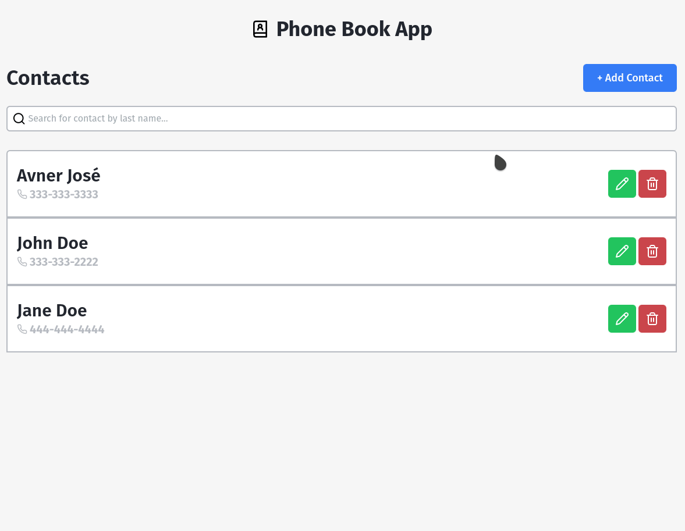
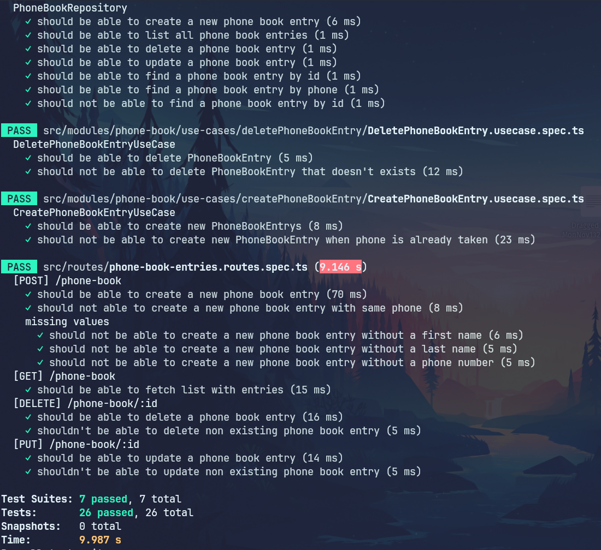
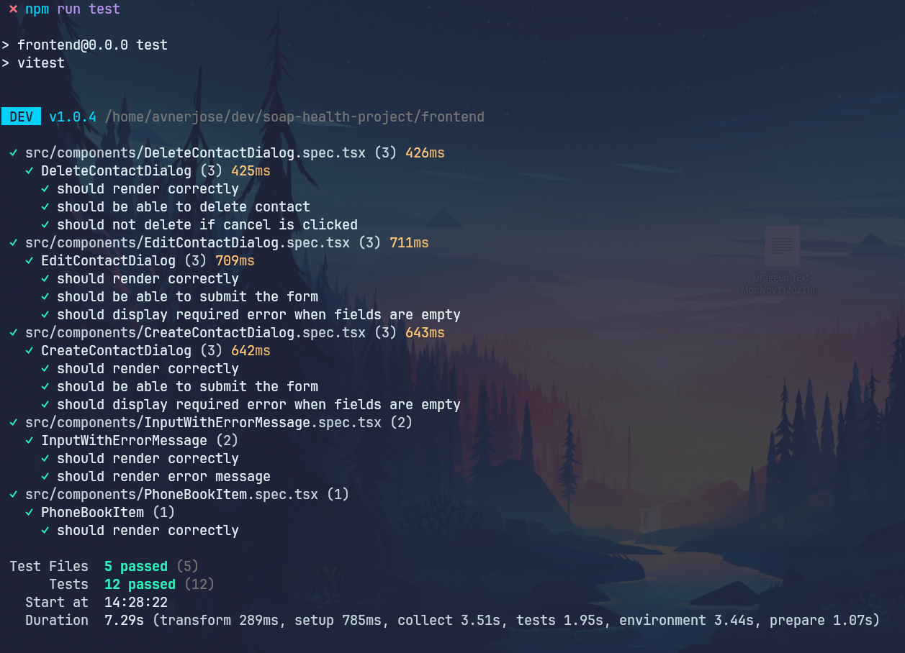

<h1 align="center" widht="50%">

    
  
  
  

</h1>

## ⚡️ The Project

This is a full-stack application developed in NodeJS and React for the SOAP health selection process, it consists in a Phone Book App with an API with all the CRUD methods (GET, POST, DELETE, PUT) and a front-end that connects to that API.

  

## 🚀️ How to run this project

1. Clone this repository:

```bash
git clone https://github.com/avnerjose/soap-health-project.git && cd soap-health-project
```

2. Go to the backend directory and install all dependencies

```bash
cd backend && npm i
```

3. Run backend code

```bash
npm run dev
```

4. Go to [localhost:3333/api-docs](http://localhost:3333/api-docs) to see the documentation and test the api

5. Open another terminal tab, navigate to the frontend directory and install all dependencies

```bash
cd frontend && npm i
```

6. Run frontend code

```bash
npm run dev
```

7. Go to [localhost:5173](http://localhost:5173) to see and test the app

## 🎯 Features

- API with POST,GET, DELETE and PUT methods
- Error handling on both front and back
- Swagger documentation
- Form validation
- Unit and Integration tests
- Toast notifications
- Accessibility components

## 🖥️ Used Technologies

- [NodeJS](https://nodejs.org/en/)
- [React](https://react.dev/)
- [Express](https://expressjs.com/pt-br/)
- [Swagger](https://swagger.io/)
- [TailwindCSS](https://tailwindcss.com/)
- [ReactHookForm](https://react-hook-form.com/)
- [Vitest](https://vitest.dev/)
- [ReactTestingLibrary](https://testing-library.com/docs/react-testing-library/intro/)
- [SuperTest](https://github.com/ladjs/supertest)

## ⚙️ Dependencies

- [NodeJS](https://nodejs.org/en/)

## 🧪 Tests

### Backend

- The backend app has unit tests with JEST and API tests with SuperTest.

- How to run (app needs to be running):

```bash
cd backend && npm run test
```

- Results:

  

### Frontend

- The frontend app has units tests with Vitest and React-Testing-Library

- How to run:

```bash
cd frontend && npm run test
```

- Results:

  
